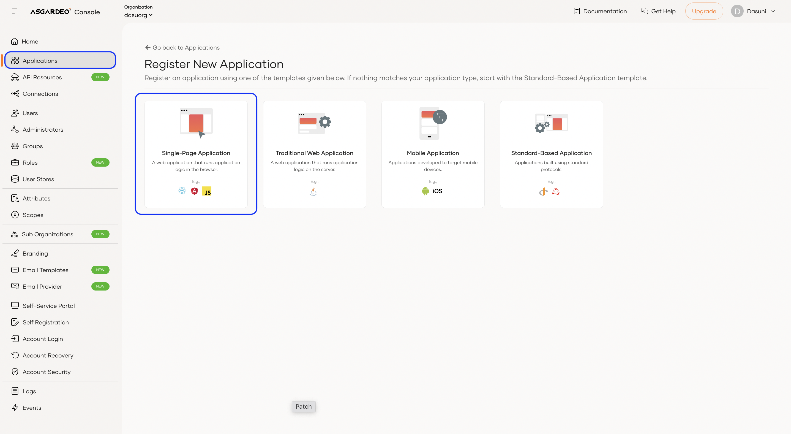
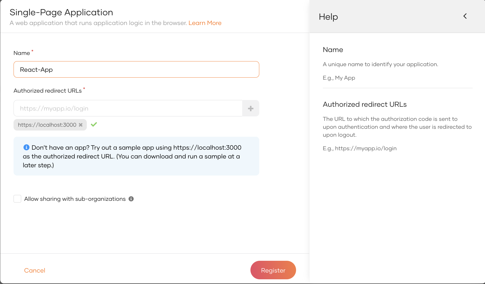
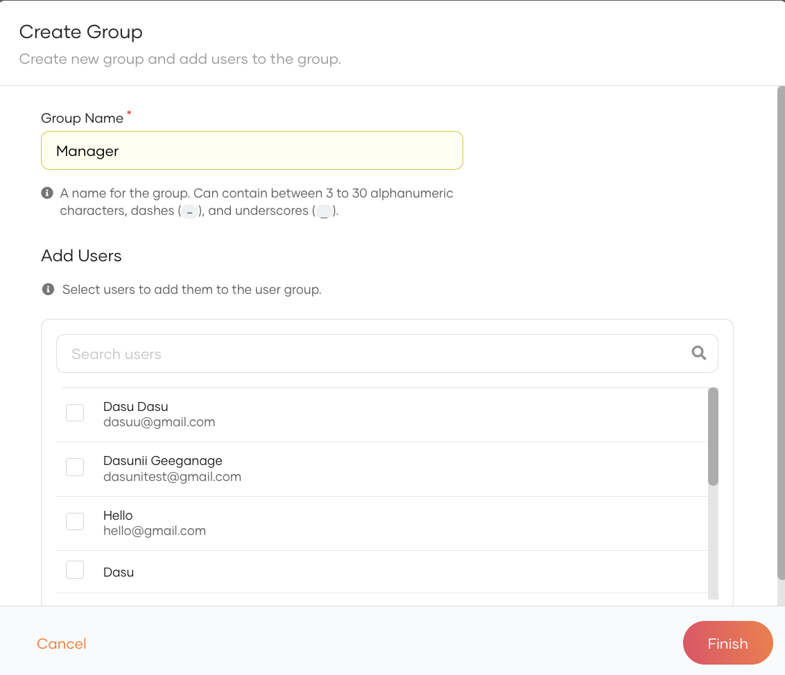
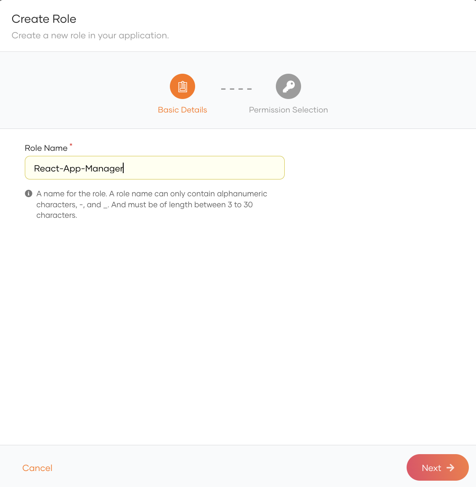
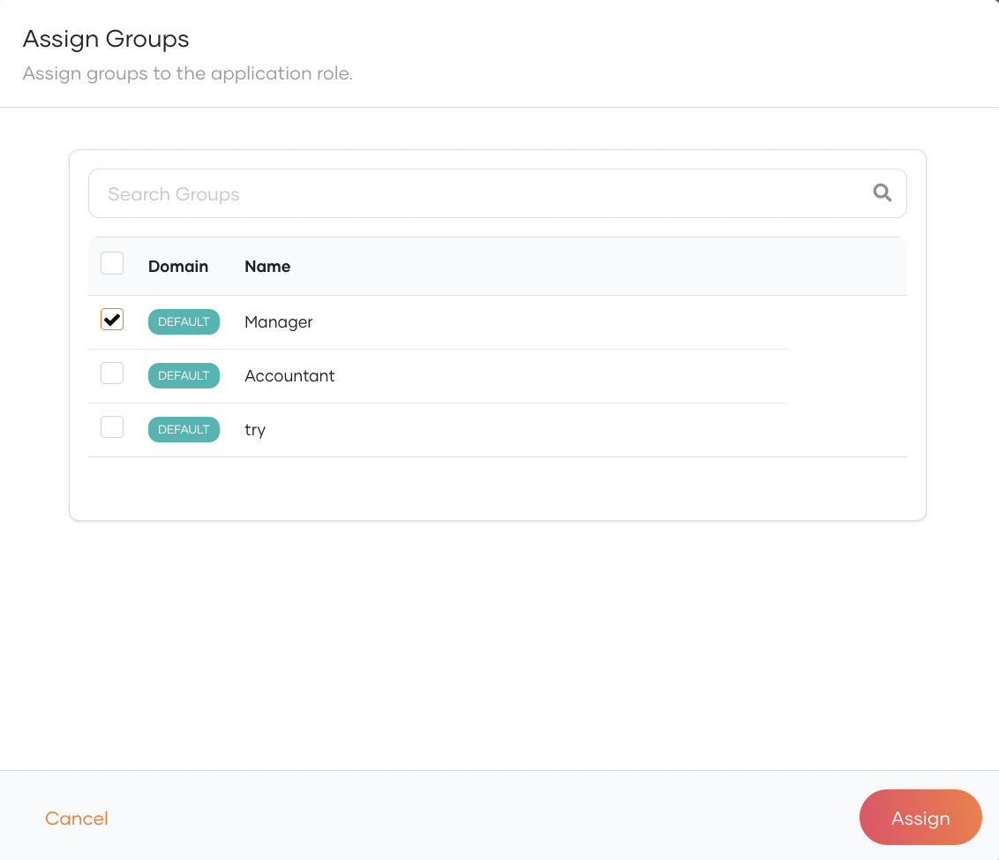
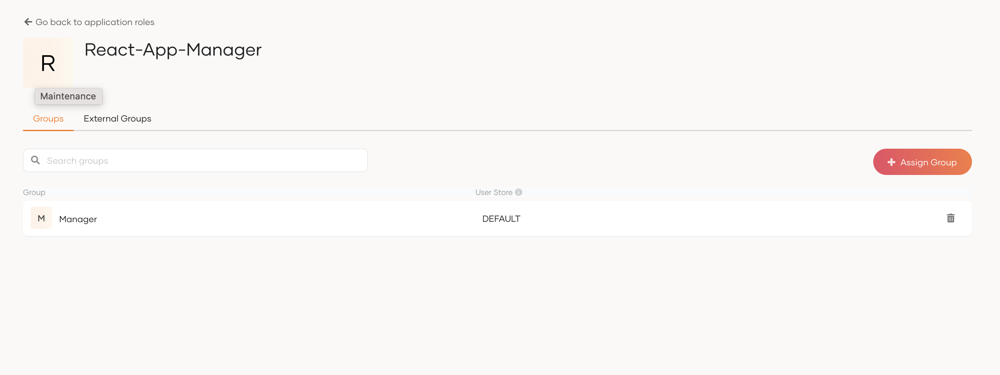
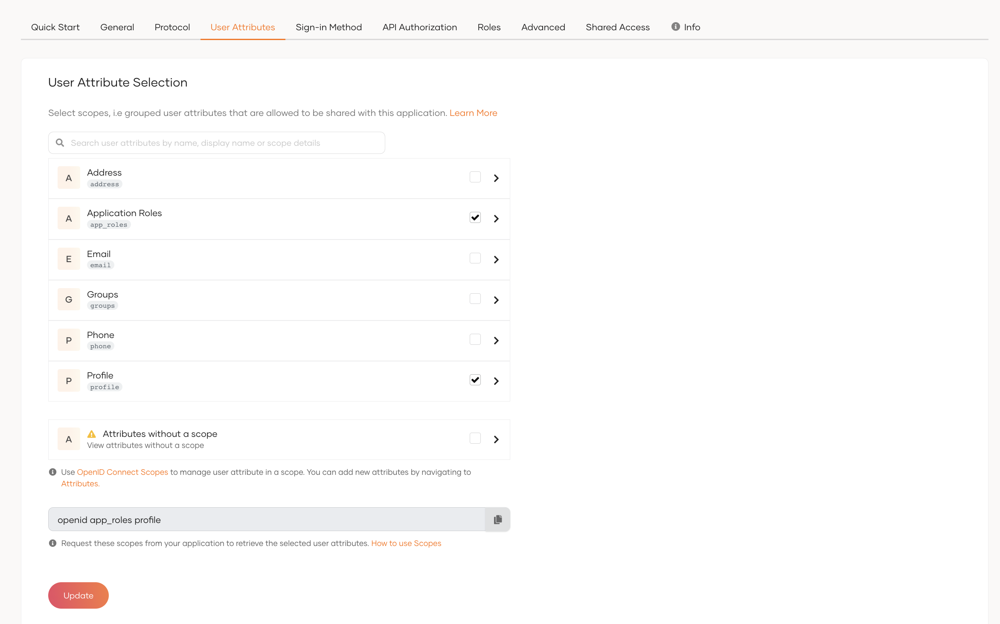
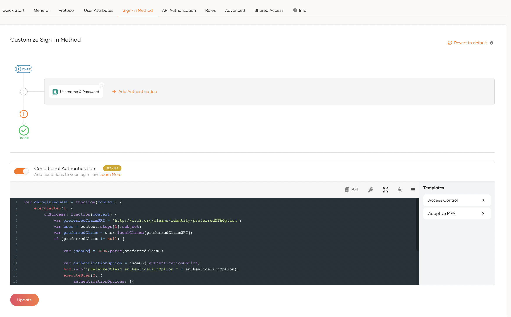

# asgardeo-react-b2c-sample-app
React sample web application to integrate with Asgardeo for B2C usecases
## 👀 Live Deployment

A live preview of this demo is available at
1. Vercel: [https://asgardeo-react-sample-app.vercel.app](https://asgardeo-react-sample-app.vercel.app)
2. Netlify: [https://kaleidoscopic-medovik-1bf3fc.netlify.app](https://kaleidoscopic-medovik-1bf3fc.netlify.app)

## Features/ Capabilities

- Sign up to Asgardeo as a new user 
- Sign In and Sign Out of the application
- Home page with the references and guides
- The user roles Manager and User.
  - Manager can view the Profile and API call pages
  - User can view the Profile page
- User Profile to view and update details.
- API call page to send an API call.
- User can set up the preferred option for second factor authentication

## Configure Asgardeo to integrate with your application

Create the application

1. Access Asgardeo at https://console.asgardeo.io/ and log in.

2. Click Applications in the left navigation menu.

3. Create a new application
- Select Single Page Application



4. Fill the details and click Create.
- Name: React-App
- Authorized Redirect URLs: https://localhost:3000 (Use the Add New option)



Add Application Roles

1. Navigate to  User Management > Groups from the side panel
2. Create a Group and add users



3. Create a Role in the application



4. Navigate to  User Management > Roles from the side panel and assign the group to the role





5. Allow the application_roles attribute in the application



Add Second Factor Authentication (Optional)

1. Navigate to the Sign in methods of the application

2. Add the second step authentication




## 🚀 Getting Started

1. Clone the repository.

```bash
git clone https://github.com/dasuni-30/asgardeo-react-sample-app.git
```

2. Install the dependencies.

```bash
npm install
```

3. Create a `.env` file based on the `.env.example` file.

```bash
cp .env.example .env
```

4. Update the values in the `.env` file based on your requirements.

```bash
# The port number on which the client application will run
PORT=3000

# The base URL of the server's API that the client application will communicate with
# E.g., http://localhost:5000
REACT_APP_API_ENDPOINT=<add-server-api-url>

# The client ID for the Asgardeo Single Page Application (SPA) app
REACT_APP_CLIENT_ID=<add-asgardeo-spa-app-client-id-here>

# The base URL for the client application
# E.g., http://localhost:3000
REACT_APP_CLIENT_BASE_URL=<add-client-app-base-url-here>

# The base URL for the Asgardeo organization's API
# E.g., https://api.asgardeo.io/t/your-org
REACT_APP_ASGARDEO_BASE_URL=<add-asgardeo-org-base-url-here>

# The sign-up URL for the Asgardeo organization
REACT_APP_SIGN_UP_URL=<asgardeo-sign-up-url>

# The application name for the Asgardeo application
REACT_APP_APPLICATION_NAME=<application-name>

# The organization name for the Asgardeo
REACT_APP_ORG_NAME=<org-name>

```

5. Start the development server.

```bash
npm start
```

This will start the app on [http://localhost:3000](http://localhost:3000).
